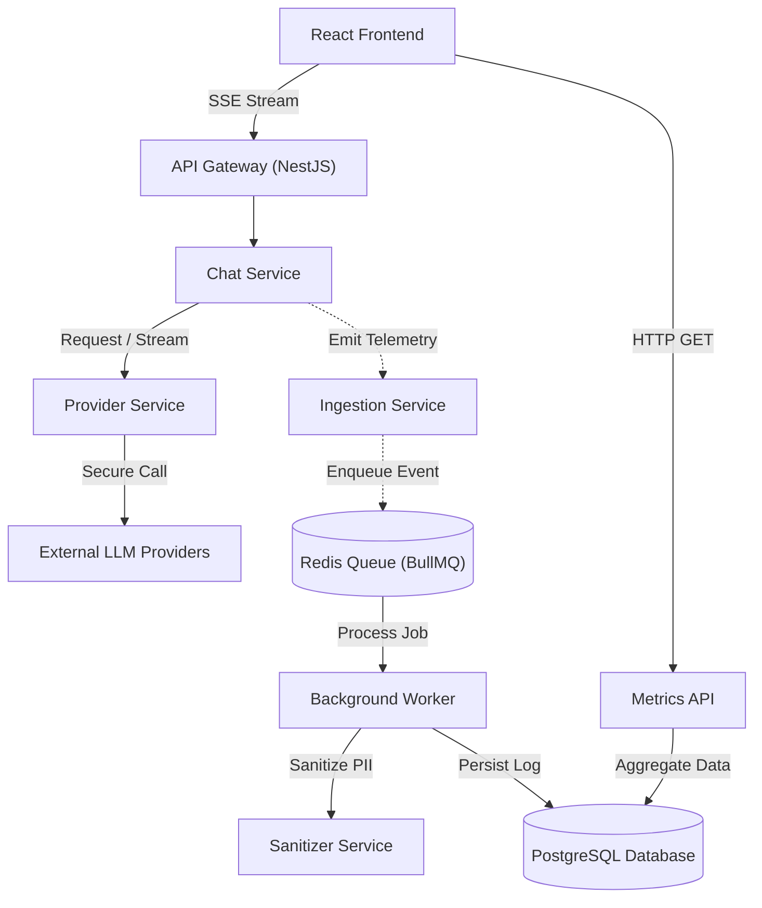

<div align="center">
  
  # Ollive LLM Observability Platform

  [](https://opensource.org/licenses/MIT)
  [](https://nestjs.com/)
  [](https://react.dev/)
  [](https://www.typescriptlang.org/)
  [](https://www.prisma.io/)
  [](https://tailwindcss.com/)
  [](https://www.docker.com/)
  [](https://kubernetes.io/)

  ### *A High-Performance Observability Platform and Multi-Provider LLM Chat Gateway.*
</div>

---

## Table of Contents

- [Key Features](#key-features)
- [System Architecture](#system-architecture)
- [Ingestion Flow & Logging](#ingestion-flow--logging)
- [Provider Abstraction & Fallbacks](#provider-abstraction--fallbacks)
- [Event-Driven Design](#event-driven-design)
- [SSE Streaming](#sse-streaming)
- [Database Schema & Indexing](#database-schema--indexing)
- [PII Redaction](#pii-redaction)
- [Scaling & Resiliency](#scaling--resiliency)
- [Core Tradeoffs](#core-tradeoffs)
- [Local Setup & Workflow](#local-setup--workflow)
- [Docker & Kubernetes Deployment](#docker--kubernetes-deployment)
- [Future Improvements](#future-improvements)

---

## Key Features

* **Out-of-Band Telemetry:** The application captures LLM execution metrics (latency, tokens) asynchronously, ensuring that telemetry ingestion never blocks the user's chat stream.
* **Dynamic Fallback Routing:** If a primary model fails during stream initialization, the system intercepts the error and transparently routes the request to a secondary model.
* **Framework-Agnostic SDK:** A standalone instrumentation wrapper (`packages/inference-sdk`) intercepts AI calls without coupling to the main database or framework.
* **Asynchronous PII Scrubbing:** Background workers automatically sanitize sensitive information (e.g., emails, credit cards) before persisting logs to the database.
* **Analytics Dashboard:** A responsive React UI leveraging TanStack Query and Recharts to visualize latency, token distribution, and error rates.
* **Kubernetes Ready:** Fully declarative deployment manifests designed for container orchestration.

---

## System Architecture

Ollive is a modular monorepo that strictly decouples the client API gateway from background telemetry processing. 

For an in-depth breakdown of our design decisions, please review our [Architecture Notes](docs/architecture.md).



---

## Ingestion Flow & Logging

We ensure that observability logging never degrades the core user experience through an independent SDK wrapper.

1. **Stream Interception**: The SDK wraps the LLM stream to monitor its lifecycle, tracking timestamps and counting token usage.
2. **Fire-and-Forget Ingestion**: Upon stream completion or failure, the SDK dispatches the log data to a BullMQ queue. This operates inside a non-blocking `try/catch` block—meaning if the Redis queue goes down, the user's chat remains perfectly functional.

---

## Provider Abstraction & Fallbacks

A unified `ProviderService` abstracts underlying AI integrations (like Google Gemini and Groq), providing a standard interface for the application.

### Probing Fallbacks for Streams
Streaming fallbacks are notoriously difficult because errors surface mid-stream. We solve this using a probing strategy:
* We initiate the stream and immediately call `next()` on the asynchronous iterator to verify the connection.
* If it succeeds, we yield the chunk and return the stream.
* If it throws an error or returns empty, we catch it instantly, abort the primary request, and establish a new stream with a backup provider (e.g., failing over from Groq's Llama to Google's Gemini).

---

## Event-Driven Design

Ollive utilizes a queue-based architecture (**BullMQ + Redis**) to decouple high-volume log ingestion from the API gateway:

* **Exponential Backoff:** If a log persistence operation fails, the worker retries up to 4 times with exponentially increasing delays.
* **Memory Management:** Redis automatically trims completed and failed jobs to prevent memory exhaustion during traffic spikes.
* **Dead Letter Queue (DLQ):** Unprocessible events that exhaust all retries are routed to a DLQ for developer inspection, keeping the main ingestion pipeline unblocked.

---

## SSE Streaming

We stream AI responses using **Server-Sent Events (SSE)** instead of WebSockets. 

* **Unidirectional Fit:** LLM streaming is strictly server-to-client. SSE handles this natively over HTTP, whereas WebSockets carry unnecessary overhead for full-duplex communication.
* **Firewall Compatibility:** Because SSE operates over standard HTTP `text/event-stream`, it bypasses common issues with proxy upgrades and corporate firewalls.
* **Native Resiliency:** Modern browsers inherently manage connection buffering and automatic retries for SSE.

---

## Database Schema & Indexing

Data is persisted in **PostgreSQL** using the **Prisma ORM**. The schema is optimized to balance fast conversational writes with heavy analytical reads.

### Strategic Indexing
To ensure sub-second dashboard queries without requiring a dedicated OLAP database, we apply targeted indexes:
* `@@index([createdAt])`: Accelerates time-series filtering (e.g., "last 7 days").
* `@@index([provider, model])`: Optimizes distribution charts and volume calculations.
* `@@index([createdAt, provider])`: Allows PostgreSQL to perform index-only scans for provider latency trends over time.

---

## PII Redaction

To maintain privacy compliance, sensitive information in user prompts and model responses must be scrubbed before database persistence.

* **Background Execution**: Redaction runs in the worker process, keeping the regex overhead entirely off the user's critical stream path.
* **Regex Scrubbing**: The `SanitizerService` identifies and replaces Emails, Phone Numbers, and Credit Cards with safe placeholders (e.g., `[REDACTED_EMAIL]`).
* **Payload Truncation**: Chat inputs and outputs are safely truncated to a standard length (e.g., 1000 characters) to optimize storage while maintaining observability previews.

---

## Scaling & Resiliency

The system architecture is designed to handle high concurrency and survive localized component failures:

* **Stateless API:** The NestJS API gateway holds no session state in memory. Instances can be scaled horizontally behind a standard load balancer to handle traffic spikes.
* **Decoupled Workers:** Background workers operate independently. If telemetry volume surges, the Redis queue acts as a shock absorber until worker capacity catches up.
* **Graceful Degradation:** If the PostgreSQL database crashes, user chats continue unimpeded; logs simply queue up in Redis until database connectivity is restored.

---

## Core Tradeoffs

Here are the practical architectural tradeoffs made to balance performance with delivery speed:

| Decision | Alternative | Rationale | Tradeoff Mitigation |
| :--- | :--- | :--- | :--- |
| **BullMQ + Redis** | **Apache Kafka** | Provides low-latency event queueing and excellent operational simplicity without JVM broker overhead. | Redis is memory-bound; mitigated by rapidly persisting jobs to PostgreSQL and aggressive queue pruning. |
| **Prisma ORM** | **TypeORM** | Offers superior schema-first modeling, robust type safety, and seamless migrations. | Slight overhead on complex queries; mitigated by implementing highly targeted composite indexes for analytics. |
| **SSE Streaming** | **WebSockets** | Perfect fit for unidirectional text generation, avoiding full-duplex handshake overhead and firewall blocking. | Cannot receive client messages on the same socket; mitigated by using standard REST POST endpoints for prompts. |
| **Anonymous Sessions** | **OAuth Auth** | Allows frictionless user onboarding and avoids database-lookup latency on streaming execution. | Cross-device tracking is impossible; acceptable for a lightweight observability gateway implementation. |

---

## Local Setup & Workflow

Ensure you have **Node.js 20.11+** and **Docker** installed on your machine.

### Native Bootstrapping
1. **Install dependencies**: `npm install`
2. **Setup environment**: `cp .env.example .env`
3. **Start the database and Redis**: `docker compose up -d postgres redis`
4. **Prepare the database**:
   ```bash
   npm run prisma:generate --workspace @repo/api
   npm run prisma:migrate:deploy --workspace @repo/api
   ```
5. **Run the Application**: `npm run dev`

* **Frontend**: `http://localhost:5173`
* **Backend API**: `http://localhost:3001`

---

## Docker & Kubernetes Deployment

Ollive is configured for cloud deployment.

### Docker Compose
To run the full stack (Frontend, API, Worker, Database) inside Docker:
```bash
docker compose up --build
```

### Kubernetes
Deployment manifests are located in the `/k8s` directory, separated by tier.

To deploy locally using Minikube:
```bash
bash k8s/deploy.sh
```

---

## Future Improvements

Given more development time, the following enhancements would be prioritized:

1. **OLAP Database Integration**: Transitioning metrics storage from PostgreSQL to a column-oriented store like **ClickHouse** to support real-time aggregates over hundreds of millions of logs.
2. **OpenTelemetry Standardization**: Upgrading the custom SDK to emit standard OpenTelemetry spans, allowing direct integration with APM providers like Datadog or Honeycomb.
3. **Advanced NER Redaction**: Replacing regex-based PII scrubbing with a lightweight Named Entity Recognition (NER) model to reliably detect names, organizations, and addresses.
4. **Dynamic Cost Tracking**: Integrating precise model pricing tables to calculate and track exact USD costs based on prompt and completion token usage.
